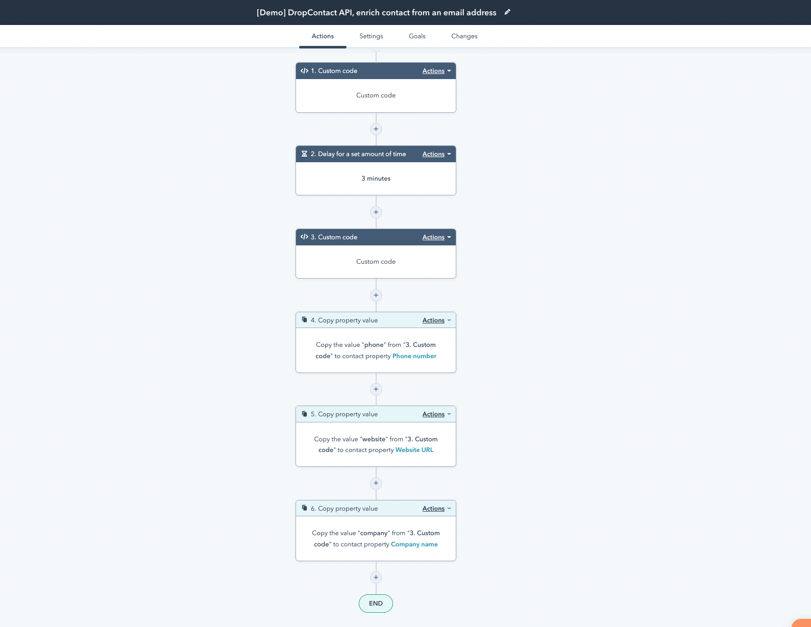
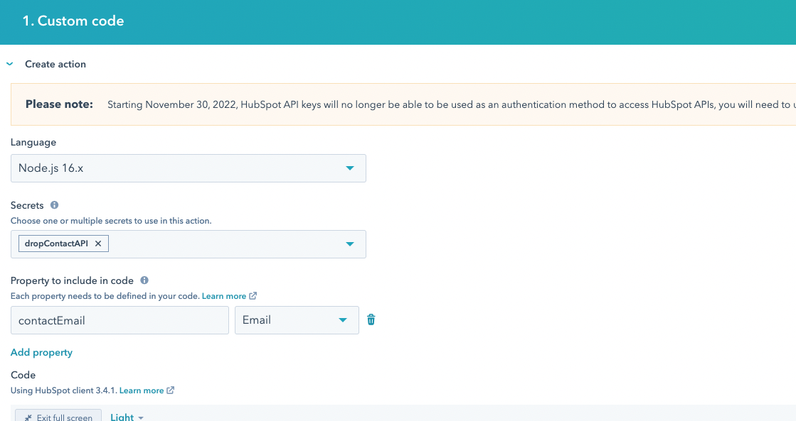
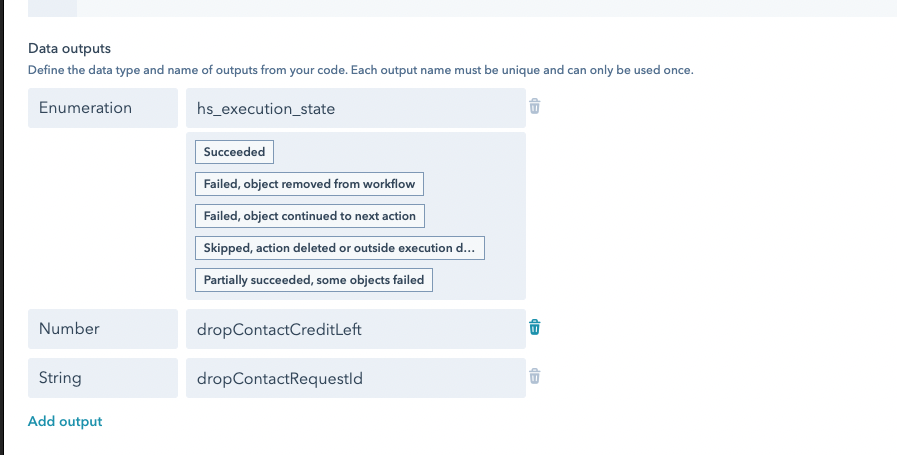
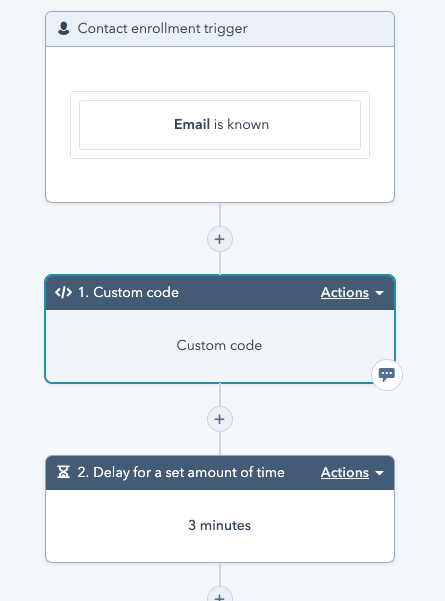
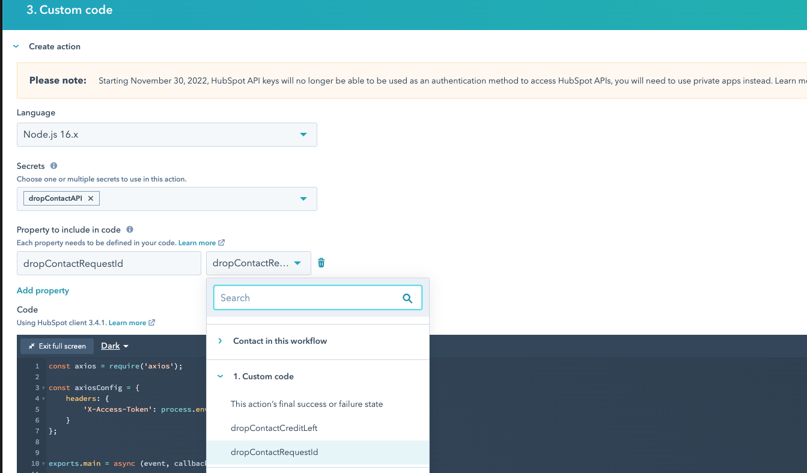
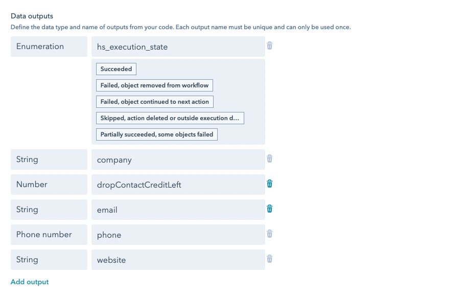

# HubSpot Custom Coded Action Drop Contact integration

This Custom Coded Action connects with the https://www.dropcontact.com/ API 


## WorkFlow overview 





## setup

You have to create a workflow with a contact based trigger with at least an email adress as a filter. 


Then create 2 Custom Coded Action, one with ```drop-contact-api-query/cca.js```

You need to have an API key for dropcontact, this key has to be added in the secrets with the name ```dropContactAPI```
Pay attention to extra withe spaces. 


Then as displayed on the screenshot below put add ```contactEmail``` as a "propety to include in code" then select Email in the list 




The output : 





One the first  Custom Coded Action is setup insert a delay : 





Then add the second  Custom Coded Action you can find in ```drop-contact-api-query-results/cca.js```


The secrets and properties to include in code have to be setup this way : 





The output setting should look like that : 




Then you can use the copy property values block to save the data in the CRM 